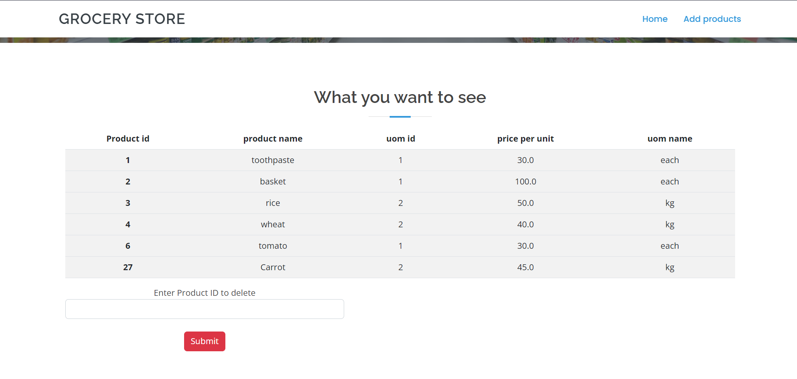

# Grocery_Management

Grocery Management System is a 3-tier project which consists the MySQL database connectivity, Flask as a backend server and bootstrap as a
front end

Structure of Project:-
1: First of all, the MySQL database is created with the help of DBMS, The product table is created in it.
2: This MySQL database is connected to the Flask server with the help of mysql.connector
3: Mudular python programming is done for connection, fetch, add and delete the data from database.
4: Flask server is connected to the HTML files that are rendered in main file.

Working of project:
Geocery Management is a web project in which admin can add and delete the products, and user can see which product is availble or not.

